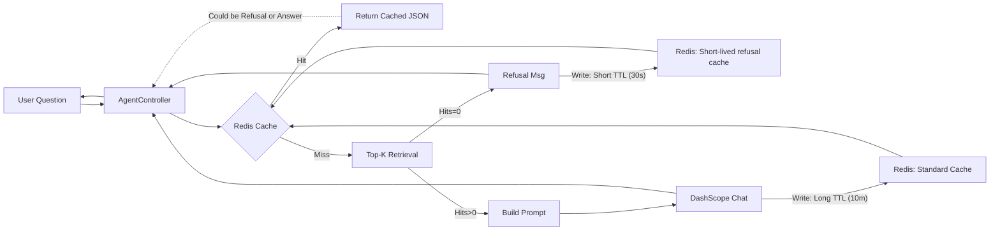
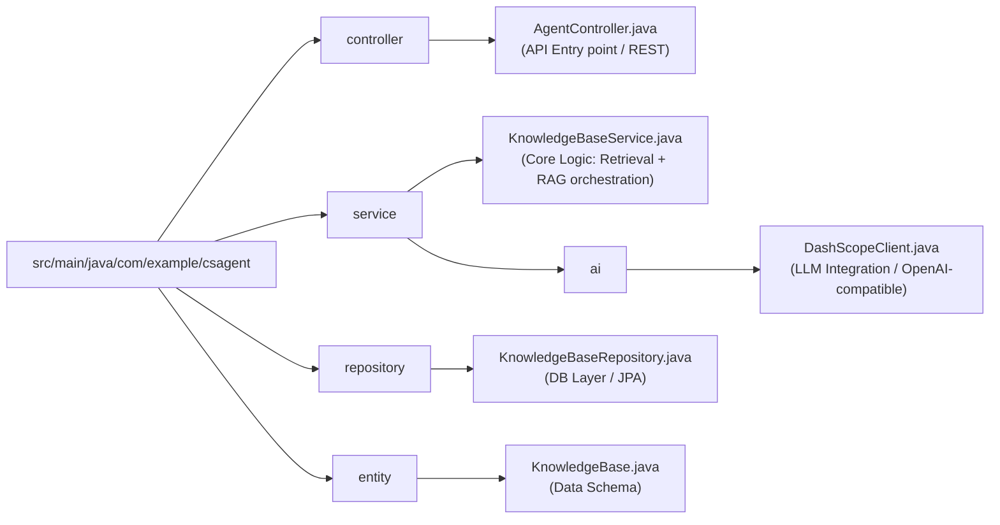

# NetEase Cloud Music Intelligent Customer Support Agent (Minimal RAG)

[](https://github.com/ChenHongshan333/Netease-music-agent-backend-demo/actions/workflows/ci.yml)


A lightweight **Retrieval-Augmented Generation (RAG)** backend for high-volume customer support scenarios, with **production-minded engineering** (profiles, Docker infra, caching, and degradation drills).

**Project Page** : <https://chenhongshan333.github.io/NetEase-music-agent-backend-demo/>

---

## Table of Contents
- [Security](#security)
- [Key Features](#key-features)
- [Install](#install)
  - [1. Prerequisites](#1-prerequisites)
  - [2. Set Environment Variable (DashScope)](#2-set-environment-variable-dashscope)
- [Usage](#usage)
  - [1. Rapid Development (Default: H2)](#1-rapid-development-default-h2)
  - [2. Production Simulation (Docker: MySQL + Redis)](#2-production-simulation-docker-mysql--redis)
  - [3. Degradation Drill (Redis Down)](#3-degradation-drill-redis-down)
- [Design notes](#design-notes)
- [Configuration](#configuration)
  - [Spring Profiles](#spring-profiles)
- [API Reference](#api-reference)
  - [Chat Interface](#chat-interface)
- [Architecture](#architecture)
  - [1. Data Flow (Fail-Fast + Cache + RAG)](#1-data-flow-fail-fast--cache--rag)
  - [2. Repository Structure](#2-repository-structure)
- [Benchmarks](#benchmarks)
- [Docker Compose Reference](#docker-compose-reference)
- [AI-Assisted Development (Vibe Coding)](#ai-assisted-development-vibe-coding)
- [License](#license)
- [Author](#author)

---

## Security
- **Never commit API keys.** Use env var `DASHSCOPE_API_KEY`.
- If you use `.env`, make sure it’s in `.gitignore`.

---

## Key Features
- Strict Grounding Policy (Fail-Fast)
- Dual-Profile Support (Dev vs Prod Simulation)
- Redis Caching (Hot Query Optimization)
- Minimal Retrieval Baseline (Top-K)
> You can refer to the **Project Page** for more detailed explanation. 
  
---

## Install

### 1. Prerequisites
**Required**
- **JDK 17** (Java 17)
- **Git** (to clone the repo)
- **DashScope API Key** (set as environment variable `DASHSCOPE_API_KEY`)

**Optional (recommended for prod simulation)**
- **Docker Desktop** (to run **MySQL + Redis** via `docker compose`)

> Good news: this repo uses **Maven Wrapper** (`mvnw`), so you **don’t need to install Maven** separately.

### 2. Set Environment Variable (DashScope)

```bash
# Windows (Powershell)
setx DASHSCOPE_API_KEY "your_api_key_here"

# Restart terminal after setx, then verify:
echo $env:DASHSCOPE_API_KEY


# macOS / Linux (bash/zsh)
export DASHSCOPE_API_KEY="your_api_key_here"
echo $DASHSCOPE_API_KEY
```

---

## Usage

> Note (Windows): In **PowerShell**, `curl` may be an alias of `Invoke-WebRequest`.  
> If the commands below fail, use **`curl.exe`** instead (or run in CMD/Git Bash).

### 1. Rapid Development (Default: H2)
Zero infrastructure required.

```bash
# Windows
.\mvnw.cmd spring-boot:run

# macOS / Linux
./mvnw spring-boot:run
```

**After startup:**

* **Swagger UI:** `http://localhost:8080/swagger-ui/index.html`
* **H2 Console:** `http://localhost:8080/h2`

Seed a few KnowledgeBase entries via Swagger UI to reproduce retrieval hits.  
**Example KnowledgeBase payload:**

```json
{
  "question": "怎么取消会员自动续费",
  "answer": "进入 App【个人中心】->【会员中心】->【管理续费】-> 选择订阅并取消。",
  "keywords": "取消 自动续费 会员"
}
```

**Quick test:**

```bash
# Standard
curl -G "http://localhost:8080/api/agent/chat" --data-urlencode "question=怎么取消自动续费"

# PowerShell fallback
curl.exe -G "http://localhost:8080/api/agent/chat" --data-urlencode "question=怎么取消自动续费"
```

### 2. Production Simulation (Docker: MySQL + Redis)

#### 2.1 Start infrastructure
If you already have `docker-compose.yml` in repo root, just run:

```bash
docker compose up -d
docker ps
```

You should see containers like:
* `csagent-mysql`
* `csagent-redis`

**After startup:**

* **Swagger UI:** `http://localhost:8080/swagger-ui/index.html`
* **MySQL (Docker):** connect to `localhost:3306` (db: `netease_agent`)
* **Redis (Docker):** connect to `localhost:6379`

#### 2.2 Run with prod profile

```bash
# Windows (PowerShell)
.\mvnw.cmd spring-boot:run -Dspring-boot.run.profiles=prod

# macOS / Linux
./mvnw spring-boot:run -Dspring-boot.run.profiles=prod
```

#### 2.3 Verify (cache + refusal gate)
1.  Seed KnowledgeBase (same as dev).
2.  Call the same question multiple times:

```bash
# Standard
curl -G "http://localhost:8080/api/agent/chat" --data-urlencode "question=怎么取消自动续费"
curl -G "http://localhost:8080/api/agent/chat" --data-urlencode "question=怎么取消自动续费"

# PowerShell fallback
curl.exe -G "http://localhost:8080/api/agent/chat" --data-urlencode "question=怎么取消自动续费"
curl.exe -G "http://localhost:8080/api/agent/chat" --data-urlencode "question=怎么取消自动续费"
```

**Expected log patterns (typical):**
* **1st request:** `cache=MISS` → `llm=CALL` → `cache=WRITE`
* **2nd request:** `cache=HIT` (no `llm=CALL`)
* **If you ask an unknown question:** `cache=MISS` → `gate=REFUSAL` `hits=0` `llm=SKIP` (and refusal cached with short TTL)

### 3. Degradation Drill (Redis Down)
Goal: prove Redis failure does not break the main request flow.

```bash
# Standard
docker stop csagent-redis
curl -G "http://localhost:8080/api/agent/chat" --data-urlencode "question=怎么取消自动续费"
docker start csagent-redis

# PowerShell fallback
docker stop csagent-redis
curl.exe -G "http://localhost:8080/api/agent/chat" --data-urlencode "question=怎么取消自动续费"
docker start csagent-redis
```

**Expected results:**
* API still returns normally.
* Logs show cache miss + Redis error swallowed (warn only), then fallback to DB/LLM path.

Now do the same thing against a **write** endpoint and watch it behave in the
opposite direction:

```bash
docker stop csagent-redis
curl.exe -X POST http://localhost:8080/api/knowledge \
  -H "Content-Type: application/json" -H "Idempotency-Key: drill-1" \
  -d '{"question":"drill","answer":"drill","keywords":"drill"}'
# -> 503 Service Unavailable, and nothing is written
docker start csagent-redis
```

That difference is deliberate. See the next section.

---

## Design notes

### 1. Reads fail open, writes fail closed — on purpose

Redis is the same dependency in both paths, and the two paths degrade in opposite
directions when it dies:

| | read path (`GET /api/agent/chat`) | write path (`POST/PUT/DELETE` with `Idempotency-Key`) |
|---|---|---|
| Redis is down | **fail open** — treat as cache miss, serve the request | **fail closed** — 503, refuse to execute |
| worst case | one extra database query and one extra model call | the write is briefly unavailable |
| why | the cache is an optimisation; correctness does not depend on it | without the store we cannot guarantee "exactly once", and a duplicate write is worse than a short outage |

The rule underneath: **degrade toward the cheaper mistake.** On the read path the
cheap mistake is doing redundant work. On the write path the cheap mistake is not
doing the work at all — because the expensive mistake, duplicating it, may not be
reversible. A blanket "Redis failures are non-fatal" policy would have been simpler
to write and would have silently allowed duplicate writes during exactly the
incident where you least want them.

Both directions are covered by tests: `CacheDegradationTest` asserts HTTP 200 with a
throwing cache, `IdempotencyTest.storeOutageFailsClosed` asserts 503 and that the
business method never ran.

#### Degrading in the right direction is not enough — it has to be fast

Running the drill against a real stopped Redis exposed that the *direction* was
correct while the *latency* made it worthless:

| | before | after |
|---|---|---|
| read path, Redis down | 200 after **120 s** | 200 after **1.2 s** |
| write path, Redis down | 503 after **60 s** | 503 after **0.3 s** |
| `/actuator/health`, Redis down | 503 after 60 s | 200 after **0.06 s** |

Cause: `spring.data.redis.timeout` was unset, so Lettuce used its 60 s default
command timeout. The read path ate two of them — one on the lookup, one on the
write-back — hence 120 s. Every one of those requests held a Tomcat worker the whole
time, so a Redis outage would have exhausted the 200-thread pool within seconds and
taken down the *entire* service, including the refusal path that needs no Redis at
all. A graceful-degradation design that stalls for a minute before degrading has
simply moved the outage, not contained it.

Fixed with an explicit `spring.data.redis.timeout=250ms` /
`connect-timeout=250ms` in the prod profile. Redis is same-host or same-LAN here and
`cache_hit` p99 is 26 ms end-to-end, so 250 ms is generous — anything slower than
that is not a slow Redis, it is an absent one. Verified afterwards that normal
operation is unaffected: cache hits still land in 11–51 ms.

The lesson generalises: **every timeout that is only reached during an incident is
untested until you actually cause the incident.** The default was invisible in every
green test and every benchmark run.

### 2. "I don't know" is 200; "I'm broken" is 503

The refusal gate answers with HTTP **200** and `hits: 0`. An upstream failure — the
circuit breaker being open, or retries exhausted — answers with **503** plus
`Retry-After`.

These must not be collapsed into one status. Retrying a refusal is pointless: the
knowledge base still will not contain the answer, and the client burns a round trip
to learn the same thing. Retrying a degraded response is exactly the right move.
Returning 200 for both would leave every caller with only two bad options — never
retry, or retry everything.

The `Retry-After` value is the circuit breaker's open duration, so the client is
told to come back precisely when we will next probe the upstream.

### 3. The degraded answer is never cached

A successful answer is cached for 600 s; a refusal for 30 s; a **degraded** response
for zero. Caching it would let a few seconds of upstream trouble pin
*"小云暂时无法回答"* in the cache for ten minutes, still served long after the
upstream recovered. That is cache poisoning, and it converts a brief incident into a
long one.

---

## Configuration

### Spring Profiles
Use `dev` by default and switch to `prod` when running with Docker.

**application.properties**
```properties
spring.profiles.default=dev
```

**application-dev.properties** (H2; example)
```properties
spring.datasource.url=jdbc:h2:mem:testdb
spring.datasource.driver-class-name=org.h2.Driver
spring.jpa.hibernate.ddl-auto=update
```

**application-prod.properties** (MySQL + Redis; example)
```properties
# MySQL (prod)
spring.datasource.url=jdbc:mysql://localhost:3306/cs_agent?useSSL=false&allowPublicKeyRetrieval=true&serverTimezone=Asia/Singapore
spring.datasource.username=cs
spring.datasource.password=cs_pass
spring.jpa.hibernate.ddl-auto=update

# Redis (prod)
spring.data.redis.host=localhost
spring.data.redis.port=6379

# Cache policy
agent.cache.enabled=true
agent.cache.ttl-seconds=600
agent.cache.refusal-ttl-seconds=30
```
---

## API Reference

### Chat Interface
`GET /api/agent/chat?question=...`

**Example:**
```bash
curl -G "http://localhost:8080/api/agent/chat" --data-urlencode "question=怎么取消自动续费"
```

**Response:**
```json
{
  "answer": "进入 App【个人中心】->【会员中心】->【管理续费】-> 选择订阅并取消。",
  "hits": 2
}
```

**Behavior:**
* `hits = 0` → fixed refusal (no LLM call)
* `hits > 0` → LLM-generated answer grounded on Known Info

---
## Architecture

### 1. Data Flow (Fail-Fast + Cache + RAG)

1. Input normalization (trim / simple cleanup)
2. Redis cache lookup (hot query optimization)
3. Top-K retrieval from KnowledgeBase (K=5)
4. Refusal gate: if `hits == 0`, return refusal (no LLM)
5. Prompt assembly: inject Known Info
6. LLM inference (DashScope OpenAI-compatible endpoint)
7. Write-back to Redis with TTL (Short TTL for refusals to avoid stale refusals)


```mermaid
flowchart LR
  U[User Question] --> C[AgentController]
  C --> KV{Redis Cache}

  %% Read Path: Cache Hit
  KV -- Hit --> H[Return Cached JSON]
  H -.->|Could be Refusal or Answer| C

  %% Write Path: Cache Miss -> Split Logic
  KV -- Miss --> R[Top-K Retrieval]

  %% Branch 1: No Knowledge (Refusal)
  R -- Hits=0 --> Z[Refusal Msg]
  Z -- "Write: Short TTL (30s)" --> W1[Redis: Short-lived refusal cache]
  W1 --> KV
  Z --> C

  %% Branch 2: Knowledge Found (Answer)
  R -- Hits>0 --> P[Build Prompt]
  P --> L[DashScope Chat]
  L -- "Write: Long TTL (10m)" --> W2[Redis: Standard Cache]
  W2 --> KV
  L --> C

  C --> U

```

### 2. Repository Structure

Key source files map to the architecture above:


```mermaid
graph LR
    %% Root Package
    Root["src/main/java/com/example/csagent"]

    %% Packages (Folders)
    PkgCtrl[controller]
    PkgSvc[service]
    PkgAi[ai]
    PkgRepo[repository]
    PkgEntity[entity]

    %% Files with descriptions (using <br/> for clarity)
    FileAC["AgentController.java<br/>(API Entry point / REST)"]
    FileKBS["KnowledgeBaseService.java<br/>(Core Logic: Retrieval + RAG orchestration)"]
    FileDSC["DashScopeClient.java<br/>(LLM Integration / OpenAI-compatible)"]
    FileKBR["KnowledgeBaseRepository.java<br/>(DB Layer / JPA)"]
    FileKB["KnowledgeBase.java<br/>(Data Schema)"]

    %% Structure Relationships
    Root --> PkgCtrl --> FileAC
    Root --> PkgSvc
    PkgSvc --> FileKBS
    PkgSvc --> PkgAi --> FileDSC
    Root --> PkgRepo --> FileKBR
    Root --> PkgEntity --> FileKB
```

---

## Benchmarks

Measured on 2026-08-17, `prod` profile (MySQL + Redis via docker-compose), AMD Ryzen
7 8745H / 16 logical cores / 15.3 GB, JDK 17.0.12, Spring Boot 4.0.1. Load generator
is `benchmarks/bench.py` (standard library only) on the same host.

| scenario | n | concurrency | p50 | p95 | p99 | throughput | upstream |
|---|---|---|---|---|---|---|---|
| `refusal` — retrieval 0 hits, refusal gate fires | 500 | 20 | 23.4 ms | 33.3 ms | 43.0 ms | 778 req/s | not called |
| `cache_hit` — Redis hit | 500 | 20 | 13.5 ms | 21.9 ms | 26.3 ms | 1321 req/s | not called |
| `llm_path` — full chain, **real DashScope** | 20 | 1 | 2364 ms | 3175 ms | 3175 ms | — | `qwen-plus` |
| `llm_path` — full chain, **stubbed upstream** (2364 ms injected) | 500 | 20 | 2401 ms | 2446 ms | 2469 ms | 8.3 req/s | stub |

Two things these numbers are for:

- **The refusal gate is worth ~95×** at p95 (33.3 ms vs 3175 ms), and it spends zero
  API quota. Questions the knowledge base cannot ground never reach the model.
- **The service adds 1.6 % on top of upstream latency.** With the upstream pinned to
  a known 2364 ms, measured p50 is 2401 ms — 37 ms for two `SELECT`s, prompt
  assembly and two Redis operations. Throughput lands within 2 % of the theoretical
  `20 / 2.364 s`, so at concurrency 20 the service contributes no queueing.

The real-DashScope row and the stubbed row measure different things on purpose: the
first is what a user waits, the second is what the service can carry regardless of
how the upstream feels today. Do not quote them interchangeably.

Reproducing the load test also **found a real bug**: `spring.jpa.open-in-view`
defaults to on, so a JDBC connection was pinned for the whole request — including
the 2.4 s model call that needs no database. Hikari's default pool of 10 therefore
became the concurrency ceiling: at concurrency 20 only ~10 requests were ever in
flight, giving 3.5 req/s instead of 8.3. Full A/B and the reasoning for fixing it by
releasing the connection rather than growing the pool are in
[docs/benchmarks.md](docs/benchmarks.md).

> **Full metadata, repro commands, per-run raw output and the reproducibility
> check**: [docs/benchmarks.md](docs/benchmarks.md).

---

## Docker Compose Reference
If you don’t already have it, create `docker-compose.yml` in project root:

```yaml
services:
  mysql:
    image: mysql:8.0
    container_name: csagent-mysql
    environment:
      MYSQL_DATABASE: cs_agent
      MYSQL_USER: cs
      MYSQL_PASSWORD: cs_pass
      MYSQL_ROOT_PASSWORD: root_pass
      TZ: Asia/Singapore
    ports:
      - "3306:3306"
    volumes:
      - mysql_data:/var/lib/mysql
    healthcheck:
      test: ["CMD", "mysqladmin", "ping", "-h", "localhost", "-uroot", "-proot_pass"]
      interval: 5s
      timeout: 5s
      retries: 30

  redis:
    image: redis:7-alpine
    container_name: csagent-redis
    command: ["redis-server", "--appendonly", "yes"]
    ports:
      - "6379:6379"
    volumes:
      - redis_data:/data
    healthcheck:
      test: ["CMD", "redis-cli", "ping"]
      interval: 5s
      timeout: 3s
      retries: 30

volumes:
  mysql_data:
  redis_data:
```

**Tip (Windows):** if you don’t have `redis-cli` locally, run it inside the container:
```bash
docker exec -it csagent-redis redis-cli
# then you can run: FLUSHDB
```

---

## AI-Assisted Development (Vibe Coding)
Built with AI assistance using **Cursor** (model: GPT-5.2) in a human-in-the-loop workflow:
- scaffolding Spring Boot wiring
- iterating docs/diagrams
- debugging traces and dependency issues

All changes were manually reviewed and verified via reproducible drills (cache hit/miss + Redis-down degradation).

---
## License
MIT License. See `LICENSE` for details.

---
## Author
Chen Hongshan
