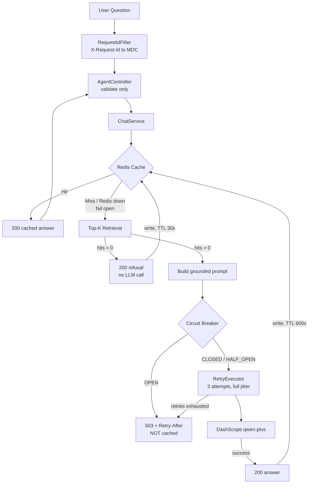

# NetEase Cloud Music Intelligent Customer Support Agent (Minimal RAG)

[](https://github.com/ChenHongshan333/Netease-music-agent-backend-demo/actions/workflows/ci.yml)


A lightweight **Retrieval-Augmented Generation (RAG)** backend for high-volume customer support scenarios, with **production-minded engineering** (profiles, Docker infra, caching, and degradation drills).

**Project Page** : <https://chenhongshan333.github.io/NetEase-music-agent-backend-demo/>

---

## Table of Contents
- [Security](#security)
- [Key Features](#key-features)
- [Install](#install)
  - [1. Prerequisites](#1-prerequisites)
  - [2. Set Environment Variable (DashScope)](#2-set-environment-variable-dashscope)
- [Usage](#usage)
  - [1. Rapid Development (Default: H2)](#1-rapid-development-default-h2)
  - [2. Production Simulation (Docker: MySQL + Redis)](#2-production-simulation-docker-mysql--redis)
  - [3. Degradation Drill (Redis Down)](#3-degradation-drill-redis-down)
- [Design notes](#design-notes)
- [Configuration](#configuration)
  - [Spring Profiles](#spring-profiles)
  - [Application settings](#application-settings)
- [API Reference](#api-reference)
  - [Chat Interface](#chat-interface)
  - [Write endpoints (idempotent)](#write-endpoints-idempotent)
  - [Operations](#operations)
- [Architecture](#architecture)
  - [1. Data Flow (Fail-Fast + Cache + RAG + Resilience)](#1-data-flow-fail-fast--cache--rag--resilience)
  - [2. Repository Structure](#2-repository-structure)
- [Benchmarks](#benchmarks)
- [Observability](#observability)
- [Roadmap / Known Limitations](#roadmap--known-limitations)
- [Docker Compose Reference](#docker-compose-reference)
- [AI-Assisted Development (Vibe Coding)](#ai-assisted-development-vibe-coding)
- [License](#license)
- [Author](#author)

---

## Security
- **Never commit API keys.** Use env var `DASHSCOPE_API_KEY`.
- If you use `.env`, make sure it’s in `.gitignore`.

---

## Key Features

- **Refusal gate (fail-fast grounding)** — 0 retrieval hits means no LLM call at all.
  Worth ~95x at p95 and zero API spend on questions we cannot ground.
- **Hand-written resilience** — explicit timeouts, full-jitter backoff retry, and a
  three-state circuit breaker. No resilience4j; `grep -c resilience4j pom.xml` is 0.
- **Idempotent writes** — `Idempotency-Key` on every write endpoint, with replay,
  409/422 handling and differentiated 4xx/5xx behaviour.
- **Opposed degradation directions** — the read path fails open on a Redis outage,
  the write path fails closed. [Why](#design-notes).
- **Observability** — request-id correlation, Prometheus metrics with a
  cardinality guard test, and a health indicator that refuses to mark the instance
  DOWN for an optional dependency.
- **Real benchmarks** — [measured, reproducible numbers](#benchmarks), no estimates.
- **Zero-dependency test suite** — 107 tests, no Redis, no MySQL, no API key, <40s.

> You can refer to the **Project Page** for more detailed explanation.

---

## Install

### 1. Prerequisites
**Required**
- **JDK 17** (Java 17)
- **Git** (to clone the repo)
- **DashScope API Key** (set as environment variable `DASHSCOPE_API_KEY`)

**Optional (recommended for prod simulation)**
- **Docker Desktop** (to run **MySQL + Redis** via `docker compose`)

> Good news: this repo uses **Maven Wrapper** (`mvnw`), so you **don’t need to install Maven** separately.

### 2. Set Environment Variable (DashScope)

```bash
# Windows (Powershell)
setx DASHSCOPE_API_KEY "your_api_key_here"

# Restart terminal after setx, then verify:
echo $env:DASHSCOPE_API_KEY


# macOS / Linux (bash/zsh)
export DASHSCOPE_API_KEY="your_api_key_here"
echo $DASHSCOPE_API_KEY
```

---

## Usage

> Note (Windows): In **PowerShell**, `curl` may be an alias of `Invoke-WebRequest`.  
> If the commands below fail, use **`curl.exe`** instead (or run in CMD/Git Bash).

### 1. Rapid Development (Default: H2)
Zero infrastructure required.

```bash
# Windows
.\mvnw.cmd spring-boot:run

# macOS / Linux
./mvnw spring-boot:run
```

**After startup:**

* **Swagger UI:** `http://localhost:8080/swagger-ui/index.html`
* **H2 Console:** `http://localhost:8080/h2`

Seed a few KnowledgeBase entries via Swagger UI to reproduce retrieval hits.  
**Example KnowledgeBase payload:**

```json
{
  "question": "怎么取消会员自动续费",
  "answer": "进入 App【个人中心】->【会员中心】->【管理续费】-> 选择订阅并取消。",
  "keywords": "取消 自动续费 会员"
}
```

**Quick test:**

```bash
# Standard
curl -G "http://localhost:8080/api/agent/chat" --data-urlencode "question=怎么取消自动续费"

# PowerShell fallback
curl.exe -G "http://localhost:8080/api/agent/chat" --data-urlencode "question=怎么取消自动续费"
```

### 2. Production Simulation (Docker: MySQL + Redis)

#### 2.1 Start infrastructure
If you already have `docker-compose.yml` in repo root, just run:

```bash
docker compose up -d
docker ps
```

You should see containers like:
* `csagent-mysql`
* `csagent-redis`

**After startup:**

* **Swagger UI:** `http://localhost:8080/swagger-ui/index.html`
* **MySQL (Docker):** connect to `localhost:3306` (db: `netease_agent`)
* **Redis (Docker):** connect to `localhost:6379`

#### 2.2 Run with prod profile

```bash
# Windows (PowerShell)
.\mvnw.cmd spring-boot:run -Dspring-boot.run.profiles=prod

# macOS / Linux
./mvnw spring-boot:run -Dspring-boot.run.profiles=prod
```

#### 2.3 Verify (cache + refusal gate)
1.  Seed KnowledgeBase (same as dev).
2.  Call the same question multiple times:

```bash
# Standard
curl -G "http://localhost:8080/api/agent/chat" --data-urlencode "question=怎么取消自动续费"
curl -G "http://localhost:8080/api/agent/chat" --data-urlencode "question=怎么取消自动续费"

# PowerShell fallback
curl.exe -G "http://localhost:8080/api/agent/chat" --data-urlencode "question=怎么取消自动续费"
curl.exe -G "http://localhost:8080/api/agent/chat" --data-urlencode "question=怎么取消自动续费"
```

**Expected log patterns (typical):**
* **1st request:** `cache=MISS` → `llm=CALL` → `cache=WRITE`
* **2nd request:** `cache=HIT` (no `llm=CALL`)
* **If you ask an unknown question:** `cache=MISS` → `gate=REFUSAL` `hits=0` `llm=SKIP` (and refusal cached with short TTL)

### 3. Degradation Drill (Redis Down)
Goal: prove Redis failure does not break the main request flow.

```bash
# Standard
docker stop csagent-redis
curl -G "http://localhost:8080/api/agent/chat" --data-urlencode "question=怎么取消自动续费"
docker start csagent-redis

# PowerShell fallback
docker stop csagent-redis
curl.exe -G "http://localhost:8080/api/agent/chat" --data-urlencode "question=怎么取消自动续费"
docker start csagent-redis
```

**Expected results:**
* API still returns normally.
* Logs show cache miss + Redis error swallowed (warn only), then fallback to DB/LLM path.

Now do the same thing against a **write** endpoint and watch it behave in the
opposite direction:

```bash
docker stop csagent-redis
curl.exe -X POST http://localhost:8080/api/knowledge \
  -H "Content-Type: application/json" -H "Idempotency-Key: drill-1" \
  -d '{"question":"drill","answer":"drill","keywords":"drill"}'
# -> 503 Service Unavailable, and nothing is written
docker start csagent-redis
```

That difference is deliberate. See the next section.

---

## Design notes

### 1. Reads fail open, writes fail closed — on purpose

Redis is the same dependency in both paths, and the two paths degrade in opposite
directions when it dies:

| | read path (`GET /api/agent/chat`) | write path (`POST/PUT/DELETE` with `Idempotency-Key`) |
|---|---|---|
| Redis is down | **fail open** — treat as cache miss, serve the request | **fail closed** — 503, refuse to execute |
| worst case | one extra database query and one extra model call | the write is briefly unavailable |
| why | the cache is an optimisation; correctness does not depend on it | without the store we cannot guarantee "exactly once", and a duplicate write is worse than a short outage |

The rule underneath: **degrade toward the cheaper mistake.** On the read path the
cheap mistake is doing redundant work. On the write path the cheap mistake is not
doing the work at all — because the expensive mistake, duplicating it, may not be
reversible. A blanket "Redis failures are non-fatal" policy would have been simpler
to write and would have silently allowed duplicate writes during exactly the
incident where you least want them.

Both directions are covered by tests: `CacheDegradationTest` asserts HTTP 200 with a
throwing cache, `IdempotencyTest.storeOutageFailsClosed` asserts 503 and that the
business method never ran.

#### Degrading in the right direction is not enough — it has to be fast

Running the drill against a real stopped Redis exposed that the *direction* was
correct while the *latency* made it worthless:

| | before | after |
|---|---|---|
| read path, Redis down | 200 after **120 s** | 200 after **1.2 s** |
| write path, Redis down | 503 after **60 s** | 503 after **0.3 s** |
| `/actuator/health`, Redis down | 503 after 60 s | 200 after **0.06 s** |

Cause: `spring.data.redis.timeout` was unset, so Lettuce used its 60 s default
command timeout. The read path ate two of them — one on the lookup, one on the
write-back — hence 120 s. Every one of those requests held a Tomcat worker the whole
time, so a Redis outage would have exhausted the 200-thread pool within seconds and
taken down the *entire* service, including the refusal path that needs no Redis at
all. A graceful-degradation design that stalls for a minute before degrading has
simply moved the outage, not contained it.

Fixed with an explicit `spring.data.redis.timeout=250ms` /
`connect-timeout=250ms` in the prod profile. Redis is same-host or same-LAN here and
`cache_hit` p99 is 26 ms end-to-end, so 250 ms is generous — anything slower than
that is not a slow Redis, it is an absent one. Verified afterwards that normal
operation is unaffected: cache hits still land in 11–51 ms.

The lesson generalises: **every timeout that is only reached during an incident is
untested until you actually cause the incident.** The default was invisible in every
green test and every benchmark run.

### 2. "I don't know" is 200; "I'm broken" is 503

The refusal gate answers with HTTP **200** and `hits: 0`. An upstream failure — the
circuit breaker being open, or retries exhausted — answers with **503** plus
`Retry-After`.

These must not be collapsed into one status. Retrying a refusal is pointless: the
knowledge base still will not contain the answer, and the client burns a round trip
to learn the same thing. Retrying a degraded response is exactly the right move.
Returning 200 for both would leave every caller with only two bad options — never
retry, or retry everything.

The `Retry-After` value is the circuit breaker's open duration, so the client is
told to come back precisely when we will next probe the upstream.

### 3. The degraded answer is never cached

A successful answer is cached for 600 s; a refusal for 30 s; a **degraded** response
for zero. Caching it would let a few seconds of upstream trouble pin
*"小云暂时无法回答"* in the cache for ten minutes, still served long after the
upstream recovered. That is cache poisoning, and it converts a brief incident into a
long one.

---

## Configuration

### Spring Profiles

| profile | database | cache | LLM | needs |
|---|---|---|---|---|
| *(none)* | H2 in-memory | off | DashScope | `DASHSCOPE_API_KEY` |
| `dev` | H2 in-memory | off | **stub** | nothing at all |
| `test` | H2 in-memory | off | **stub** | nothing at all (used by CI) |
| `prod` | MySQL | **on** | DashScope | docker compose + `DASHSCOPE_API_KEY` |

```bash
./mvnw spring-boot:run -Dspring-boot.run.profiles=dev    # zero dependencies
./mvnw spring-boot:run -Dspring-boot.run.profiles=prod   # needs docker compose up
```

See [`.env.example`](.env.example) for every environment variable the service reads.

### Application settings

All defaults live in `application.properties` and are overridable per profile.

```properties
# Cache
agent.cache.enabled=true
agent.cache.ttl-seconds=600
agent.cache.refusal-ttl-seconds=30

# LLM: provider and explicit timeouts (OkHttp's defaults leave callTimeout unset)
agent.llm.provider=dashscope          # dashscope | stub
agent.llm.model=qwen-plus
agent.llm.timeout.connect-ms=2000
agent.llm.timeout.read-ms=8000
agent.llm.timeout.write-ms=2000
agent.llm.timeout.call-ms=12000

# Resilience: total budget for the LLM stage, retry and circuit breaker
agent.resilience.request-budget-ms=25000
agent.resilience.retry.max-attempts=3
agent.resilience.retry.base-backoff-ms=200
agent.resilience.retry.max-backoff-ms=2000
agent.resilience.circuit-breaker.sliding-window-size=20
agent.resilience.circuit-breaker.minimum-calls=10
agent.resilience.circuit-breaker.failure-rate-threshold=50
agent.resilience.circuit-breaker.open-duration-ms=30000
agent.resilience.circuit-breaker.half-open-permitted-calls=3

# Idempotency
agent.idempotency.ttl-hours=24
agent.idempotency.max-key-length=255

# Actuator: whitelist, never "*"
management.endpoints.web.exposure.include=health,info,metrics,prometheus
management.health.redis.enabled=false   # replaced by RedisDegradedHealthIndicator
```

Two non-obvious settings that are deliberate rather than incidental:

```properties
# Releases the JDBC connection before the ~2.4s model call. Left on, Hikari's
# default pool of 10 becomes the concurrency ceiling. See docs/benchmarks.md.
spring.jpa.open-in-view=false

# prod profile. Lettuce defaults to a 60s command timeout, which turns a Redis
# outage into 60-120s hangs and exhausts the Tomcat thread pool.
spring.data.redis.timeout=250ms
spring.data.redis.connect-timeout=250ms
```

---

## API Reference

### Chat Interface
`GET /api/agent/chat?question=...`

**Example:**
```bash
curl -G "http://localhost:8080/api/agent/chat" --data-urlencode "question=怎么取消自动续费"
```

**Response:**
```json
{
  "answer": "进入 App【个人中心】->【会员中心】->【管理续费】-> 选择订阅并取消。",
  "hits": 2
}
```

**Behavior:**
* `hits = 0` → fixed refusal (no LLM call)
* `hits > 0` → LLM-generated answer grounded on Known Info


**Status codes:**

| status | meaning | should the client retry? |
|---|---|---|
| `200` + `hits > 0` | grounded answer | — |
| `200` + `hits = 0` | refusal: the knowledge base cannot answer this | **no** — the answer will not change |
| `400` | `question` missing, blank, or over 500 characters | no, fix the request |
| `503` + `Retry-After: 30` | upstream model unavailable (circuit open or retries exhausted) | **yes**, after the given delay |

The 200-vs-503 split is deliberate; see [Design notes](#design-notes).

### Write endpoints (idempotent)

`POST /api/knowledge` · `PUT /api/knowledge/{id}` · `DELETE /api/knowledge/{id}` ·
`POST /api/conversations` · `POST /api/conversations/{id}/messages`

All accept an optional `Idempotency-Key` request header.

```bash
curl.exe -X POST http://localhost:8080/api/knowledge   -H "Content-Type: application/json"   -H "Idempotency-Key: 8f14e45f-ea23-4f1a-9c1e-2b6f0a1d7c33"   -d '{"question":"云贝有什么用","answer":"...","keywords":"云贝"}'
```

| situation | response |
|---|---|
| header absent | executes normally — the feature is opt-in and backward compatible |
| first request with this key | executes, response stored for 24 h |
| same key, same payload | replays the stored response with `Idempotency-Replayed: true`; **no second execution** |
| same key, different payload | `422` — the key was reused for a different request |
| same key, first still running | `409` + `Retry-After: 1` — the server never polls on your behalf |
| key blank or over 255 chars | `400` |
| idempotency store unavailable | `503` — writes fail closed |

A stored `4xx` is replayed; a `5xx` releases the key so a retry can succeed.

### Operations

| endpoint | purpose |
|---|---|
| `GET /health` | plain `OK` liveness string |
| `GET /actuator/health` | component health; Redis reports `DEGRADED` rather than failing the instance |
| `GET /actuator/prometheus` | metrics, including the `agent_*` business series |
| `GET /swagger-ui/index.html` | OpenAPI UI, documents `Idempotency-Key` on every write operation |

Every response carries `X-Request-Id`; send your own to correlate across services.

---

## Architecture

### 1. Data Flow (Fail-Fast + Cache + RAG + Resilience)

1. `RequestIdFilter` stamps `X-Request-Id` into MDC so every log line below is correlated
2. Redis cache lookup — hit returns immediately, having touched neither DB nor model
3. Top-K retrieval from `knowledge_base` (K=5); a second pass with the normalized question if the first misses
4. **Refusal gate**: `hits == 0` → refusal answer, **no LLM call**, cached for 30 s
5. Prompt assembly: retrieved answers become the grounding block
6. LLM call wrapped as `circuitBreaker(retry(call))` — breaker outside, retry inside
7. Success → write back with 600 s TTL. Failure → 503 + `Retry-After`, and **nothing is cached**


```mermaid
flowchart TB
  U[User Question] --> F[RequestIdFilter<br/>X-Request-Id to MDC]
  F --> C[AgentController<br/>validate only]
  C --> S[ChatService]

  S --> KV{Redis Cache}
  KV -- Hit --> H[200 cached answer]
  H --> C

  KV -- "Miss / Redis down<br/>fail open" --> R[Top-K Retrieval]

  R -- "hits = 0" --> Z["200 refusal<br/>no LLM call"]
  Z -- "write, TTL 30s" --> KV

  R -- "hits > 0" --> P[Build grounded prompt]
  P --> CB{Circuit Breaker}

  CB -- OPEN --> D["503 + Retry-After<br/>NOT cached"]
  CB -- "CLOSED / HALF_OPEN" --> RT[RetryExecutor<br/>3 attempts, full jitter]
  RT --> L[DashScope qwen-plus]

  L -- success --> A[200 answer]
  A -- "write, TTL 600s" --> KV
  RT -- "retries exhausted" --> D
```

### 2. Repository Structure

```
src/main/java/com/example/cs_agent_service/
├── controller/
│   ├── AgentController          HTTP adaptation only: validate, call, map status
│   ├── KnowledgeBaseController  CRUD, write endpoints marked @Idempotent
│   └── ConversationController   conversations and messages
├── service/
│   ├── ChatService              the pipeline: cache → retrieve → gate → prompt → LLM
│   ├── QuestionNormalizer       pure function, iterates to a fixed point
│   ├── KnowledgeBaseService     retrieval + CRUD, soft delete
│   ├── llm/
│   │   ├── LlmClient            interface
│   │   ├── LlmException         carries retryable + httpStatus
│   │   ├── DashScopeLlmClient   OkHttp, classifies failures as retryable or not
│   │   └── StubLlmClient        fixed answer + injectable delay (dev, load tests)
│   ├── resilience/
│   │   ├── RetryExecutor        hand-written, full jitter, deadline aware
│   │   └── CircuitBreaker       hand-written 3-state machine, injectable Clock
│   └── cache/RedisCacheService  swallows failures — read path fails open
├── idempotency/
│   ├── Idempotent               annotation
│   ├── IdempotencyAspect        @Around: SETNX, replay, 409/422, fail closed
│   └── IdempotencyStore         propagates failures — write path fails closed
├── observability/
│   ├── AgentMetrics             Micrometer, bounded-cardinality tags only
│   └── RedisDegradedHealthIndicator   UP + DEGRADED, never DOWN
├── web/RequestIdFilter          MDC in, MDC cleared in finally
└── config/                      @ConfigurationProperties for cache, timeouts,
                                 resilience and idempotency
```

Two classes are worth reading first: [`ChatService`](src/main/java/com/example/cs_agent_service/service/ChatService.java)
for the whole request pipeline, and [`IdempotencyAspect`](src/main/java/com/example/cs_agent_service/idempotency/IdempotencyAspect.java)
for the exactly-once write logic.

---

## Benchmarks

Measured on 2026-08-17, `prod` profile (MySQL + Redis via docker-compose), AMD Ryzen
7 8745H / 16 logical cores / 15.3 GB, JDK 17.0.12, Spring Boot 4.0.1. Load generator
is `benchmarks/bench.py` (standard library only) on the same host.

| scenario | n | concurrency | p50 | p95 | p99 | throughput | upstream |
|---|---|---|---|---|---|---|---|
| `refusal` — retrieval 0 hits, refusal gate fires | 500 | 20 | 23.4 ms | 33.3 ms | 43.0 ms | 778 req/s | not called |
| `cache_hit` — Redis hit | 500 | 20 | 13.5 ms | 21.9 ms | 26.3 ms | 1321 req/s | not called |
| `llm_path` — full chain, **real DashScope** | 20 | 1 | 2364 ms | 3175 ms | 3175 ms | — | `qwen-plus` |
| `llm_path` — full chain, **stubbed upstream** (2364 ms injected) | 500 | 20 | 2401 ms | 2446 ms | 2469 ms | 8.3 req/s | stub |

Two things these numbers are for:

- **The refusal gate is worth ~95×** at p95 (33.3 ms vs 3175 ms), and it spends zero
  API quota. Questions the knowledge base cannot ground never reach the model.
- **The service adds 1.6 % on top of upstream latency.** With the upstream pinned to
  a known 2364 ms, measured p50 is 2401 ms — 37 ms for two `SELECT`s, prompt
  assembly and two Redis operations. Throughput lands within 2 % of the theoretical
  `20 / 2.364 s`, so at concurrency 20 the service contributes no queueing.

The real-DashScope row and the stubbed row measure different things on purpose: the
first is what a user waits, the second is what the service can carry regardless of
how the upstream feels today. Do not quote them interchangeably.

Reproducing the load test also **found a real bug**: `spring.jpa.open-in-view`
defaults to on, so a JDBC connection was pinned for the whole request — including
the 2.4 s model call that needs no database. Hikari's default pool of 10 therefore
became the concurrency ceiling: at concurrency 20 only ~10 requests were ever in
flight, giving 3.5 req/s instead of 8.3. Full A/B and the reasoning for fixing it by
releasing the connection rather than growing the pool are in
[docs/benchmarks.md](docs/benchmarks.md).

> **Full metadata, repro commands, per-run raw output and the reproducibility
> check**: [docs/benchmarks.md](docs/benchmarks.md).

---

## Observability

Every response carries `X-Request-Id` (echoed if you send one, generated otherwise),
and the same id appears in every log line for that request via MDC:

```
2026-08-18T14:40:35.628+08:00  INFO 44692 --- [nio-8080-exec-3] [my-trace-123] c.e.c.service.ChatService : [chat] cache=MISS key=agent:chat:v1:0a160a7a...
```

`GET /actuator/prometheus` exposes the business series:

| metric | type | tags | meaning |
|---|---|---|---|
| `agent_cache_lookup_total` | counter | `result=hit\|miss` | cache effectiveness |
| `agent_refusal_total` | counter | `stage=no_hits` | how often the gate fires |
| `agent_retrieval_hits` | summary | — | distribution of hit counts |
| `agent_llm_call_seconds` | timer | `outcome=success\|error\|timeout`, `attempt=1\|2\|3` | per-attempt upstream latency |
| `agent_circuit_state` | gauge | `dependency=dashscope` | 0=CLOSED, 1=HALF_OPEN, 2=OPEN |
| `agent_idempotency_total` | counter | `result=new\|replayed\|conflict\|mismatch\|unavailable` | write dedup outcomes |
| `agent_degraded_total` | counter | `reason=circuit_open\|retry_exhausted` | why we shed load |

**Cardinality is enforced, not just intended.** No tag value ever derives from user
input — not the question, not the `Idempotency-Key`, not a row id. A high-cardinality
tag is a production incident that looks fine in development, so
`AgentMetricsTest.noHighCardinalityTags` drives 50 distinct questions through the
pipeline and asserts the observed tag values are a subset of a hardcoded whitelist.
Adding a user-derived tag fails the build.

### Why a Redis outage does not mark the instance DOWN

Boot's stock `RedisHealthIndicator` makes `/actuator/health` return 503 when Redis is
unreachable. Verified that behaviour here, then replaced it, because it is wrong for
this service: Redis is **optional** on the read path. An instance with a dead Redis
still answers correctly — it just answers without a cache.

Reporting DOWN would have Kubernetes or the load balancer remove a working instance
and redistribute its traffic onto the remaining ones, which are hitting the same dead
Redis. The failure gets amplified rather than contained.

So `RedisDegradedHealthIndicator` returns UP with the problem in the details:

```json
{"status":"UP","details":{"redis":"DEGRADED",
 "impact":"chat read path serves without cache; write endpoints requiring Idempotency-Key fail closed with 503",
 "error":"QueryTimeoutException"}}
```

Alertable, greppable, and it does not take a healthy instance out of rotation. The
**database** keeps Boot's default indicator and does fail the instance — that one
really is required.

Actuator exposure is a whitelist (`health,info,metrics,prometheus`), never `*`;
`/actuator/env`, `/beans`, `/configprops`, `/threaddump` and `/loggers` return 404,
asserted by test.

---

## Roadmap / Known Limitations

Stating these plainly is more useful than letting a reader discover them.

**Retrieval is lexical, not semantic.** `LIKE %q%` over `question` and `keywords`,
with a hand-written normalizer stripping punctuation and filler words as a second
pass. It cannot match a paraphrase that shares no substring. Embeddings plus a vector
index (pgvector, Milvus) is the obvious next step and would change the character of
the project — which is exactly why it is scoped out rather than half-done.

**Chat is single-turn.** `/api/agent/chat` neither reads nor writes the
`conversations` tables, so there is no context carried between questions. The
conversation model exists and is tested, but is not yet wired into the chat pipeline.

**No streaming.** Responses arrive whole after ~2.4 s. SSE would make the wait feel
far shorter without changing the measured latency.

**No authentication or rate limiting.** Anyone who can reach the port can spend API
quota. Fine for a demo, not for anything exposed.

**Cache invalidation is TTL-only.** Editing a knowledge-base entry does not evict
answers derived from it; they age out within 600 s. A version-number namespace in the
cache key would fix this cheaply.

**Logs are plain text.** Structured JSON logging (`logstash-logback-encoder`) would
make the request-id correlation machine-queryable rather than greppable.

**Benchmarks are single-host.** Load generator, service, MySQL and Redis all share
one laptop, so absolute throughput is optimistic relative to a real deployment with
network hops between tiers. The ratios are the trustworthy part.

---

## Docker Compose Reference
If you don’t already have it, create `docker-compose.yml` in project root:

```yaml
services:
  mysql:
    image: mysql:8.0
    container_name: csagent-mysql
    environment:
      MYSQL_DATABASE: cs_agent
      MYSQL_USER: cs
      MYSQL_PASSWORD: cs_pass
      MYSQL_ROOT_PASSWORD: root_pass
      TZ: Asia/Singapore
    ports:
      - "3306:3306"
    volumes:
      - mysql_data:/var/lib/mysql
    healthcheck:
      test: ["CMD", "mysqladmin", "ping", "-h", "localhost", "-uroot", "-proot_pass"]
      interval: 5s
      timeout: 5s
      retries: 30

  redis:
    image: redis:7-alpine
    container_name: csagent-redis
    command: ["redis-server", "--appendonly", "yes"]
    ports:
      - "6379:6379"
    volumes:
      - redis_data:/data
    healthcheck:
      test: ["CMD", "redis-cli", "ping"]
      interval: 5s
      timeout: 3s
      retries: 30

volumes:
  mysql_data:
  redis_data:
```

**Tip (Windows):** if you don’t have `redis-cli` locally, run it inside the container:
```bash
docker exec -it csagent-redis redis-cli
# then you can run: FLUSHDB
```

---

## AI-Assisted Development (Vibe Coding)
Built with AI assistance using **Cursor** (model: GPT-5.2) in a human-in-the-loop workflow:
- scaffolding Spring Boot wiring
- iterating docs/diagrams
- debugging traces and dependency issues

All changes were manually reviewed and verified via reproducible drills (cache hit/miss + Redis-down degradation).

---
## License
MIT License. See `LICENSE` for details.

---
## Author
Chen Hongshan
